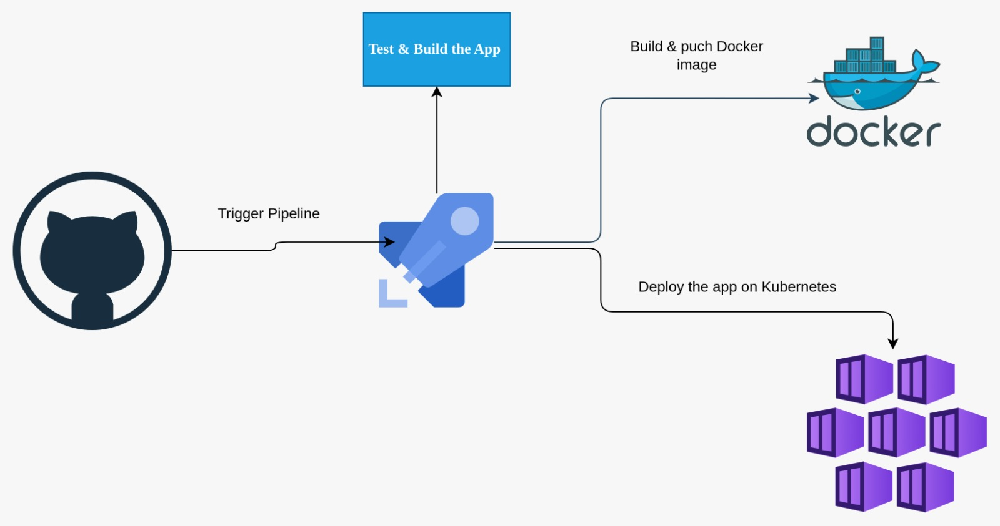

## Architecture Diagram

## Task Overview

The goal of this challenge was to use Azure DevOps for Continuous Integration and Continuous Deployment (CI/CD) to dockerize a Spring Boot application and deploy it on a Kubernetes cluster. The task consisted of the following stages:

1. Lint Stage
2. Unit Test Stage
3. SonarQube Stage
4. Build Image Stage
5. Push Image to Registry (Docker Hub)
6. Pull Image from Registry
7. Deploy Spring Boot app to Kubernetes cluster
8. Create Ingress for the app (with a /live endpoint)
9. Deploy on the development environment
10. Deploy on the production environment

## Approach

### CI/CD Solution

I utilized Azure DevOps as the preferred CI/CD solution for this task. The pipeline was defined in a YAML file, which is available in the repository.

### Codebase and Gradle

The attached Spring Boot application was built using Gradle as the build tool. The source code and build scripts are organized in a clear and maintainable directory structure.

### Dockerization

I created a Dockerfile to containerize the Spring Boot application. The Docker image is built as part of the CI/CD pipeline and pushed to Docker Hub for version control.

### Testing

I incorporated unit tests using Gradle's testing framework to ensure the application's functionality. These tests were executed in the Unit Test Stage of the pipeline.

### Static Code Analysis

I integrated SonarQube for static code analysis, which was performed in the SonarQube Stage of the pipeline. The analysis helps identify code quality issues and maintain clean code standards.

### Kubernetes Deployment

The Spring Boot application is deployed to a Kubernetes cluster of choice. I used Minikube for local development and testing purposes. The deployment includes the creation of an Ingress resource with a /live endpoint.

### Documentation

I provided comprehensive documentation in this README to explain the task, my approach, and the structure of the codebase. Additionally, an architecture diagram is available in the repository to visualize the CI/CD pipeline.

## Pipeline Execution

The CI/CD pipeline was executed in Azure DevOps, and the results are available in the associated pull request.

## Additional Contributions 

- I successfully provisioned self-host agents for the pipeline.
- The codebase and pipeline configurations are well-documented in the README and code comments.
- I maintained a clean directory and file structure with clear naming conventions.

##  Pull Request

I have raised a pull request to the `main` branch as per the task requirements. Please refer to the pull request for a detailed review of my code and approach.

